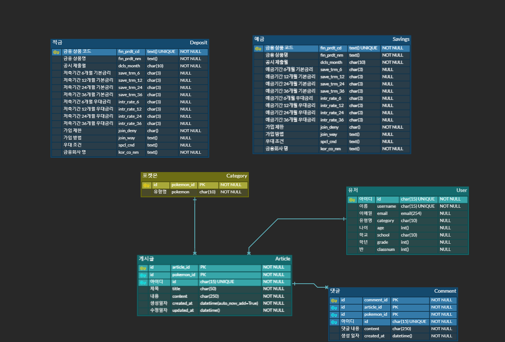

# WONKIDS
- **진행 기간** : 2023.11.16(목) ~ 2023.11.24(금)  

- **서비스 대상** : 경제 교육이 필요한 대전에 거주하고 있는 초등학생 (만 7세 ~ 만 12세)  

- **목적**  : 서비스 대상에게 시각적인 자료를 제공하고 능동적으로 웹페이지와 상호작용을 하면서 경제지식을 즐겁게 배울 수 있도록 함

## I. 팀원 정보 및 업무 분담 내역
- **팀장: 김보경**  
    - 기획 및 설계
        - Vue 컴포넌트 상속구조 구성
    - 백엔드 및 프론트엔드 기능 구현
        - 메인 페이지
        - 예금 & 적금 금리 비교
            - 금융 API 데이터 저장
            - 전체 조회 
            - 상세 조회
        - 근처 은행 검색
        - 프로필 페이지
    - CSS 
    

- **팀원: 임지현**
    - 기획 및 설계
        - Django 구조 구성
    - 백엔드 및 프론트엔드 기능 구현
        - 메인 페이지
        - User 커스터마이징
        - 회원가입, 로그인, 로그아웃 등 회원 관리 기능
        - 환율 계산기
        - 커뮤니티(게시판)
        - 금융 상품 추천 알고리즘   
    - 프로젝트 설명 작성
    - PPT 제작  
    - CSS 보조

|  날짜  |  업무 담당자 | 업무 분담 내역 |
|:------|:-------------:|:---------- |
| 11/16 | 김보경,<br>임지현 | - 프로젝트 컨셉 기획 및 기능 설계 |
| 11/17 | 김보경 | - 프로젝트 컨셉 기획 및 기능 설계<br>- 프론트엔드 스켈레톤 코드 작성<br>|
||임지현| - 프로젝트 컨셉 기획 및 기능 설계<br>- 백엔드 스켈레톤 코드 작성<br>- User 커스터마이징|
| 11/18 | 김보경 | - 금융 API 구조 파악<br> - 예적금 데이터 DB 저장<br>|
|       | 임지현 | - User 커스터마이징 디버깅<br>- WinError 10061 디버깅|
| 11/19 | 김보경 | - 근처 은행 검색 기능 구현<br>- 예적금 DB 데이터 vue 연결<br>|
|       | 임지현 | - 회원가입, 로그인, 로그아웃 기능 구현<br>- 토큰 인증 방식 설정|
| 11/20 | 김보경 | - vue에 예적금 데이터 상속 구조 설계<br>- CSS 근처 은행 검색 페이지<br> |
|       | 임지현 | - 부트스트랩 스타일 적용<br>- 메인페이지 carousel 디버깅<br>- 커뮤니티 게시판 기능 구현<br>-  404 페이지 설정<br>- 게시글 CRUD 기능 추가<br>- field name 충돌로 Category, Article 모델 재정의|
| 11/21 | 김보경 | - 프로필 페이지 vue 연결<br>- CSS 예적금 전체페이지, 상세페이지<br>- CSS 로그인, 로그아웃, 회원가입 페이지 |
|       | 임지현 | - 환율 계산기 기능 구현<br>- 커뮤니티 게시판 글 작성 시 Anonymous user 반환으로 인한 User 커스터마이징 디버깅<br>- 커뮤니티 CRUD 디버깅 및 댓글 생성 및 삭제 기능 구현|
| 11/22 | 김보경 | - CSS 환율 계산기<br>- CSS 커뮤니티(게시판) 페이지<br>- CSS 커뮤니티(게시판) 상세 페이지 |
|       | 임지현 | - 금융 상품 추천을 위한 유형검사 기능 구현<br>- 금융 상품 추천 결과값 위한 함수 구현|
| 11/23 | 김보경 | - CSS 설문조사 문항, 답변 작성<br>- CSS 설문조사 Q&A 페이지<br>- CSS 설문조사 결과 조회 페이지<br>- CSS 프로필 페이지<br>- CSS 메인 페이지<br>|
|       | 임지현 | - 금융 상품 추천 결과값 프로필 페이지에 구현<br>- 프로필 페이지 디버깅<br>- Vue에 들어갈 내용 작성<br>- 설계 내용 및 실제 구현 정도 작성<br>- 금융 상품 추천 알고리즘에 대한 기술적 설명 작성<br>- 서비스 대표 기능들에 대한 설명 작성<br>- 발표 PPT 제작|
| 11/24 | 김보경,<br>임지현 | - 추가 CSS<br>- 프로젝트 마무리 |
 

## II. 설계 내용(아키텍처 등) 및 실제 구현 정도

### 사용 아키텍처
- Django REST Framework & Vue3

- Front-end

```
📦final-pjt-front
 ┣ 📂wonkids
 ┃ ┣ 📂src
 ┃ ┃ ┣ 📂assets
 ┃ ┃ ┃ ┣ 📜arrow.png
 ┃ ┃ ┃ ┣ 📜article.png
 ┃ ┃ ┃ ┣ 📜articletitle.png
 ┃ ┃ ┃ ┣ 📜bank.jpg
 ┃ ┃ ┃ ┣ 📜bye2.gif
 ┃ ┃ ┃ ┣ 📜bye3.jpg
 ┃ ┃ ┃ ┣ 📜carousel3.jpg
 ┃ ┃ ┃ ┣ 📜case1.jpg
 ┃ ┃ ┃ ┣ 📜case2.jpg
 ┃ ┃ ┃ ┣ 📜case3.jpg
 ┃ ┃ ┃ ┣ 📜case4.webp
 ┃ ┃ ┃ ┣ 📜case5.png
 ┃ ┃ ┃ ┣ 📜case6.webp
 ┃ ┃ ┃ ┣ 📜case7.jpg
 ┃ ┃ ┃ ┣ 📜exchange.jpg
 ┃ ┃ ┃ ┣ 📜exchangeRate.png
 ┃ ┃ ┃ ┣ 📜kobugi.webp
 ┃ ┃ ┃ ┣ 📜pairi.jpg
 ┃ ┃ ┃ ┣ 📜pikachu.webp
 ┃ ┃ ┃ ┣ 📜pokeball.webp
 ┃ ┃ ┃ ┣ 📜poll.jpg
 ┃ ┃ ┃ ┣ 📜sleep.png
 ┃ ┃ ┃ ┗ 📜wonkids.png
 ┃ ┃ ┣ 📂components
 ┃ ┃ ┃ ┣ 📜BankDeposit.vue
 ┃ ┃ ┃ ┣ 📜BankListDeposit.vue
 ┃ ┃ ┃ ┣ 📜BankListSavings.vue
 ┃ ┃ ┃ ┣ 📜BankSavings.vue
 ┃ ┃ ┃ ┣ 📜CommentCreate.vue
 ┃ ┃ ┃ ┗ 📜CommentList.vue
 ┃ ┃ ┣ 📂router
 ┃ ┃ ┃ ┗ 📜index.js
 ┃ ┃ ┣ 📂stores
 ┃ ┃ ┃ ┣ 📜articles.js
 ┃ ┃ ┃ ┣ 📜auth.js
 ┃ ┃ ┃ ┣ 📜banks.js
 ┃ ┃ ┃ ┣ 📜categories.js
 ┃ ┃ ┃ ┣ 📜comments.js
 ┃ ┃ ┃ ┣ 📜polls.js
 ┃ ┃ ┃ ┗ 📜profile.js
 ┃ ┃ ┣ 📂views
 ┃ ┃ ┃ ┣ 📜ArticleCreateView.vue
 ┃ ┃ ┃ ┣ 📜ArticleListView.vue
 ┃ ┃ ┃ ┣ 📜ArticleUpdateView.vue
 ┃ ┃ ┃ ┣ 📜ArticleView.vue
 ┃ ┃ ┃ ┣ 📜BankDepositDetailView.vue
 ┃ ┃ ┃ ┣ 📜BankListDepositView.vue
 ┃ ┃ ┃ ┣ 📜BankListSavingsView.vue
 ┃ ┃ ┃ ┣ 📜BankMapView.vue
 ┃ ┃ ┃ ┣ 📜BankSavingsDetailView.vue
 ┃ ┃ ┃ ┣ 📜BankTotalView.vue
 ┃ ┃ ┃ ┣ 📜ExchangeRateView.vue
 ┃ ┃ ┃ ┣ 📜HomeView.vue
 ┃ ┃ ┃ ┣ 📜LogInView.vue
 ┃ ┃ ┃ ┣ 📜LogOutView.vue
 ┃ ┃ ┃ ┣ 📜NotFoundView.vue
 ┃ ┃ ┃ ┣ 📜PollQuestionsView.vue
 ┃ ┃ ┃ ┣ 📜PollView.vue
 ┃ ┃ ┃ ┣ 📜ProfileView.vue
 ┃ ┃ ┃ ┗ 📜SignUpView.vue
 ┃ ┃ ┣ 📜App.vue
 ┃ ┃ ┗ 📜main.js
 ┃ ┣ 📜.env.local
 ┃ ┣ 📜.gitignore
 ┃ ┣ 📜index.html
 ┃ ┣ 📜package-lock.json
 ┃ ┣ 📜package.json
 ┃ ┣ 📜README.md
 ┃ ┗ 📜vite.config.js
 ┗ 📜package-lock.json
```

- Back-end
```
📦final-pjt-back
 ┣ 📂accounts
 ┃ ┣ 📜admin.py
 ┃ ┣ 📜apps.py
 ┃ ┣ 📜models.py
 ┃ ┣ 📜serializers.py
 ┃ ┣ 📜signals.py
 ┃ ┣ 📜tests.py
 ┃ ┣ 📜urls.py
 ┃ ┣ 📜views.py
 ┃ ┗ 📜__init__.py
 ┣ 📂articles
 ┃ ┣ 📜admin.py
 ┃ ┣ 📜apps.py
 ┃ ┣ 📜models.py
 ┃ ┣ 📜serializers.py
 ┃ ┣ 📜tests.py
 ┃ ┣ 📜urls.py
 ┃ ┣ 📜views.py
 ┃ ┗ 📜__init__.py
 ┣ 📂banks
 ┃ ┣ 📜admin.py
 ┃ ┣ 📜apps.py
 ┃ ┣ 📜models.py
 ┃ ┣ 📜serializers.py
 ┃ ┣ 📜tests.py
 ┃ ┣ 📜urls.py
 ┃ ┣ 📜views.py
 ┃ ┗ 📜__init__.py
 ┣ 📂polls
 ┃ ┣ 📜admin.py
 ┃ ┣ 📜apps.py
 ┃ ┣ 📜models.py
 ┃ ┣ 📜serializers.py
 ┃ ┣ 📜tests.py
 ┃ ┣ 📜urls.py
 ┃ ┣ 📜views.py
 ┃ ┗ 📜__init__.py
 ┣ 📂wonkids
 ┃ ┣ 📜asgi.py
 ┃ ┣ 📜settings.py
 ┃ ┣ 📜urls.py
 ┃ ┣ 📜wsgi.py
 ┃ ┗ 📜__init__.py
 ┣ 📜.env
 ┣ 📜.gitignore
 ┣ 📜db.sqlite3
 ┣ 📜manage.py
 ┗ 📜requirements.txt
```

**1. 메인 페이지**
- 팀의 서비스를 소개할 수 있도록 메인 페이지 구성
- Carousel에 제작한 웹사이트 이미지를 넣어 전체적으로 어떤 서비스가 제공되는지 확인할 수 있도록 함


**2. 회원 커스터마이징**
- 회원 관리를 할 수 있는 기능인 회원 가입, 로그인, 로그아웃 구성
- 회원 관리 라이브러리(allauth & dj-rest-auth) 등을 사용
    - Django의 기본 User 를 상속받아 커스텀 User 를 구현하고 커스텀 User를 활용하기 위해 적절한 CustomRegisterSerializer,CustomAccountAdapter, signals.py 설정  

- 필수적으로 포함해야 할 필드인 유저이름, 이메일, 가입한 상품 목록을 저장할 수 있는 필드 중 가입한 상품 목록을 저장할 수 있는 필드 구현하지 않음  
→ 교육적인 목적으로 구현하는 웹페이지 상 필요 없는 필드라 판단함

**3. 예적금 금리 비교**
- 금융 상품 데이터가 필수적으로 필요하기에 django model 설계 후 필요한 데이터만 추출
    - serializer로 model 필드에서 필요한 값만 save
    - null 값은 '-' 로 보여지도록 view 함수 구성
- 중복된 값은 다시 저장되지 않도록 filter와 exist 함수 사용

- 상품 목록을 볼 수 있도록 적절한 화면 구성
    - GET 요청을 받을 경우 serializer에 담긴 데이터 vue에 연결
    - vue 에서 axios 요청으로 django db의 데이터 불러오기
    - component view에서 store로 불러온 데이터를 화면에 구현 

- 은행을 선택하여 목록을 필터링할 수 있도록 추가적인 기능 구성
    - kor_co_nm를 비교해서 select 한 값과 일치하는 경우만 출력이 되도록 vue페이지 구성
    - 가입 기간에 따라 다른 금리 및 기타 상품 특성 고려하여 화면 구성
  
- 가입하기 버튼을 추가하여 클릭 시 해당 회원의 가입한 상품 목록에 상품 ID 추가하지 않음  
→ 교육적인 목적으로 구현하는 웹페이지 상 필요 없는 기능이라 판단해 구현하지 않음

**4. 환율 계산기**

- 적절한 API를 활용하여 현재 환율에 대한 정보 가져옴
    - ExchangeRate-API를 활용함
    - API KEY가 노출되지 않도록 .env.local 사용
- 국가를 선택할 수 있도록 구성
    - Vue select options를 활용하여 보편적으로 많이 쓰는 통화인 한국 원화, 미국 달러, 일본 엔화, 유럽 유로, 영국 파운드, 중국 위안화를 선택할 수 있게 함
- 바꾸기 버튼을 누르면 서로의 변수 값을 바꾸도록 하여 원화 입력 시 선택한 국가의 통화로 변환된 값을, 타국 통화 입력 시 해당 통화를 원화를 변환한 값을 출력하게 함

**5. 근처 은행 검색**

- KAKAO MAPS API를 활용해서 카카오 지도를 view component상에서 구성
    - vue 에 대전 지역값을 미리 저장해둔 후 사용자 선택 시 해당 지역으로 이동하도록 구현
    - 마커표시 함수를 통해 검색한 위치가 마커로 표시되도록 vue 구성

- view component 상에서 router를 활용해 예적금 페이지에서 바로 우리동네 은행을 선택할 수 있도록 구성
    - 설계 시 예적금 사이트 하위에 근처은행검색 기능을 추가하도록 계획해서 구현

- 선택 시 해당 위치 근처의 은행 정보 적절하게 출력
    - 어린이를 타겟층으로 하는 웹사이트이기 때문에 지역 정보를 선택하기 쉽게 하나의 토글로 설정  
    → 은행별로 지도에 나타나게 하는 방법은 우리동네 은행을 찾는다는 목적 상 주요 기능으로 필요하지 않다고 판단해 구현하지 않음


**6. 커뮤니티(게시판)**
- 회원 간 소통할 수 있는 커뮤니티 기능(게시판) 구현  
→ 유형인 포켓몬을 카테고리로 설정하여 해당 유형끼리 친목을 도모하거나 교류할 수 있게 함  

- 게시글 조회, 생성, 삭제, 수정 및 댓글 생성, 삭제 기능 구현
    - TokenAuthentication, permission_classes를 사용하여 웹사이트의 회원인 사람만 쓸 수 있도록 설정함
    - 조회에는 GET 요청, 생성에는 POST 요청, 삭제는 DELECT, 수정은 PUT 요청을 받게 Django에서 코드 작성 후 serializer에 담긴 데이터 Vue에 연결
    - Vue에서 axios 요청으로 Django의 결과값 데이터를 불러옴
    - component view에서 store로 불러온 데이터를 화면에 구현 

**7. 프로필 페이지**
- 금융 상품 추천 알고리즘인 설문조사 결과를 바탕으로 프로필 페이지 구성
- 결과값에 따라 component 요소가 다르게 나타나도록 함
- router를 활용해 poll component 결과 페이지에서 바로 profile로 이동할 수 있도록 함
- profile 페이지에서 추천된 정기예금, 정기적금 상품을 보여줌
- 정기예금, 정기적금 목록을 확인할 수 있는 페이지에 바로 연결될 수 있도록 router 구성함


## III. 데이터베이스 모델링(ERD)


## IV. 금융 상품 추천 알고리즘에 대한 기술적 설명

**0. 알고리즘 구현 의도**
- 유형 검사를 통해 금융 상품을 추천받을 수 있도록 알고리즘을 구현했습니다.  
- 서비스 제공 대상의 흥미를 유발하고자 유행하는 유형 검사의 틀을 사용하고, 친숙한 포켓몬을 유형으로 설정했습니다.  
- 예금, 적금이 어떤 특징을 가지는지 그 성향을 잘 이해할 수 있도록 구성했습니다.


**1. 사용자가 질문을 읽고 선택지를 누르면 선택지에 따라 할당된 점수들이 Vue에 작성된 함수에서 합산됩니다.**
- 질문은 총 5개로, 각 질문은 두 개의 응답으로 구성되어 있습니다.
- 선택지 A는 1점, 선택지 B는 0점입니다.

**2. 주어진 설문이 끝나고 결과 보러 가기 버튼을 누르면, 합산된 점수를 axios를 통해 Vue에서 Django로 전달함과 동시에 결과를 볼 수 있는 웹페이지로 이동합니다. 해당 웹페이지에 접속하면 Vue는 Django로 추천상품을 보내줄 것을 요청합니다.** 
- POST 요청을 보내면 합산된 점수를 Django 데이터베이스에 저장합니다.
- 결과를 볼 수 있는 웹페이지로 이동하면 바로 GET 요청을 보냅니다.
- GET 요청을 보내면 유형에 따라 랜덤하게 4개의 금융 상품을 가져옵니다.

**3. Django에서 전달받은 정보를 기반으로 유형을 3가지로 나눕니다. 그리고 그 값을 Django 데이터베이스에 저장합니다.**
- 누구나 알 수 있도록 가장 기본적인 포켓몬을 선택했습니다.
- 총 5점 만점으로 0~1점은 불꽃 타입 포켓몬인 **파이리**,
- 2~3점인 전기 타입 포켓몬인 **피카츄**,
- 4~5점은 물 타입 포켓몬인 꼬부기로 **포켓몬**이 결정됩니다.

**4-1. Django 데이터베이스에 유형이 저장되어 있다면 다양한 상품을 보여주기 위해 유형에 따라 랜덤하게 4개의 금융 상품을 가져와 Vue에 보내줍니다.**
- 불꽃 타입 포켓몬인 파이리는 활활 타오르는 불의 특징을 활발하고 화끈한 성격으로 연관지어 가정했습니다. 꾸준히 일정 금액을 넣으며 만기일을 기다리는 성향임을 가정하여 적금 4개를 추천합니다.
- 전기 타입 포켓몬인 피카츄는 파이리와 꼬부기를 선택한 사람의 중간으로 가정하여, 적금 2개, 예금 2개를 추천합니다.
- 물 타입 포켓몬인 꼬부기는 잔잔하게 흐르는 물의 특징을 침착하고 차분한 성향으로 연관지어 가정했습니다. 목돈을 한꺼번에 맡기고 차분히 기다릴 수 있는 성향임을 가정하여 예금 4개를 추천합니다.

**4-2. Django 데이터베이스에 유형이 저장되어 있지 않다면 유형검사를 하지 않고 해당 웹페이지에 들어온 것입니다. 유형 검사를 할 수 있는 페이지로 연결된 버튼을 누를 수 있도록 화면에 보여줍니다.**


## V. 서비스 대표 기능들에 대한 설명

**1. 예금 & 적금 금리 비교**
- 정기 예금, 정기 적금 금융상품 전체 목록을 한눈에 리스트로 출력해서 볼 수 있도록 구성했습니다. 
- 금융상품 명을 클릭하면 상세 페이지로 이동해서 상세 정보를 볼 수 있습니다.
- 은행 이름 선택 시 해당 은행의 금융 상품 목록만 필터링 되도록 만들었습니다. 

**2. 대전 은행 위치 검색**
- 토글로 위치를 선택하면 해당하는 지역으로 지도 화면이 이동하도록 만들었습니다.
- 이동한 위치에서 은행 카테고리에 들어가는 위치들만 마커로 표시되어 은행과 지점명을 알 수 있도록 구성했습니다. 

**3. 환율 계산기**
- 기본값은 한국 원화, 미국 달러로 되어 있습니다.
- 숫자를 입력할 수 있는 입력창에 알고 싶은 금액을 작성하면 선택한 다른 통화의 금액을 확인할 수 있습니다.
- 바꾸기 버튼을 누르면 입력한 통화 값과 알고 싶은 통화 값의 변수 값의 바뀌면서 반대로 입력할 수 있습니다.

**4. 커뮤니티(게시판)**
- 게시글 조회, 생성, 삭제, 수정 및 댓글 생성, 삭제를 할 수 있습니다.
- 카테고리를 유형검사 결과인 포켓몬 이름으로 설정해 같은 결과가 나온 회원끼리 교류할 수 있게 만들었습니다.

**5. 유형 검사**
- 회원의 기본 정보인 회원이름, 추천받은 금융 상품을 확인할 수 있습니다.
- 금융 상품을 추천받기 위해서 먼저 유형검사를 받아야 합니다. 만약 유형검사를 받지 않은 경우, 금융 상품 추천 목록 대신 유형검사를 할 수 있는 버튼이 있습니다.
- 유형 검사를 한 뒤에 다시 유형검사를 하고 싶은 회원을 위해 다시 유형검사를 할 수 있는 버튼이 금융 상품 추천 목록 밑에 있습니다.


## VI. 기타(느낀 점, 후기 등)
### 🍊 **김보경**
금융상품 추천서비스 프로젝트를 일주일간 수행하고 마무리하며 이론으로 django와 vue를 배우는 것과는 달리 실제 project를 구현하는 것은 복잡하게 이루어진다는 생각이 들었습니다. 가상환경을 생성하는 데에서 시작해서 처음부터 끝까지 무에서 웹사이트 하나를 만들어내는 경험은 앞으로 더 많은 프로젝트를 해나가는데 있어서 도움이 될 것으로 생각했습니다. 무엇보다 django와 vue를 연결해서 django에서 처리한 데이터와 함수를 axios 요청으로 store에 받아와 vue component 상에 구현하는 과정은 직접 해보지 않으면 모르는 부분이라고 생각합니다. 

막연히 프로젝트를 시작할 당시에 백엔드와 프론트엔드를 연결하는 방법도 감이 잡히지 않았지만  금융상품통합비교공시 API, Kakao Maps API를 활용해서 데이터를 db로 저장하는 과정부터 직접 django 모델 구성하고 ERD를 작성해보며 프로젝트와 모델의 구조를 잘 알게되는 계기가 되었습니다. 특히나 django에서 vue로 보내준 데이터를 component 상에 사용자가 보기 좋게 배치하고 만들어내는 과정이 의미있었다고 생각합니다. 그리고 CSS를 하며 백엔드의 알고리즘을 화면 상에 사용자가 보기 좋게 만드는 과정이 재밌고 의미가 있다는 생각이 들었습니다.프로젝트를 통해 배운 부분도 많고 보완해야 할 점들도 개인적으로 기록을 해 두었습니다. 차차 프로젝트를 해나감에 있어서 성장해나가는 사람이 되고 싶다는 생각을 하며 1주일 간의 프로젝트를 마무리했습니다. 

### 🍓 **임지현**  
약 5개월 동안 배운 내용을 바탕으로 처음 프로젝트를 하는 것이고, 또 선택한 프로젝트 주제의 요구사항이 많아 걱정이 많이 됐습니다. 계획을 철저하게 세워 돌발상황이 발생하는 것을 최대한 줄여보고자 했는데 예상치 못한 에러가 발생해 이를 해결하는 데에 시간이 많이 필요했습니다. 특히 ERD 등 설계에 많은 시간을 투자했는데도 종종 이로 인해 에러가 발생해 다시 이를 수정하면서 설계가 왜 어려운지 알게 되었습니다. 앞으로 어떻게 하면 설계를 잘 할 수 있을까 고민해보며 이에 대해 더 공부해보고 싶다고 생각했습니다.

처음 프로젝트를 기획할 때 유형검사를 가장 만들고 싶어 이에 대한 조사를 많이 했는데 기대했던 것보다 결과가 좋아 만족스러웠습니다. Vue에서의 결과값을 Django로 보내고, 이 결과값을 Django의 User DB에 저장하고, 이 DB에 접근하여 가져온 값을 바탕으로 추천할 금융 상품을 Bank DB에서 가져와 다시 결과를 Vue로 보내는 등 Vue와 Django 사이에 데이터를 주고받도록 코드를 짜면서 둘의 관계를 이해하고 앞으로는 어떻게 코드를 짜면 되는지 학습하게 된 좋은 기회였습니다.